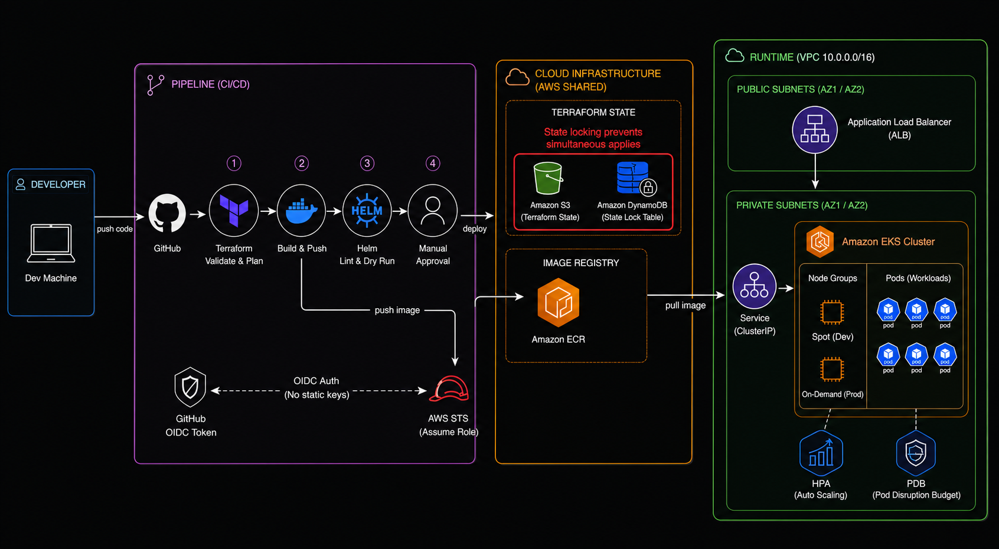
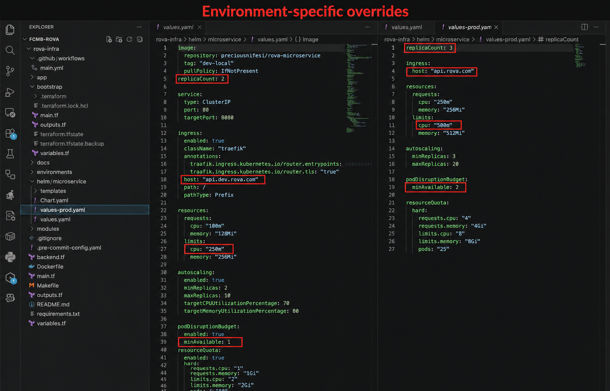
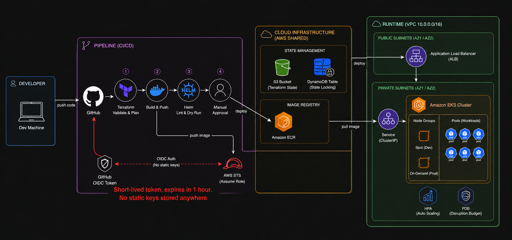
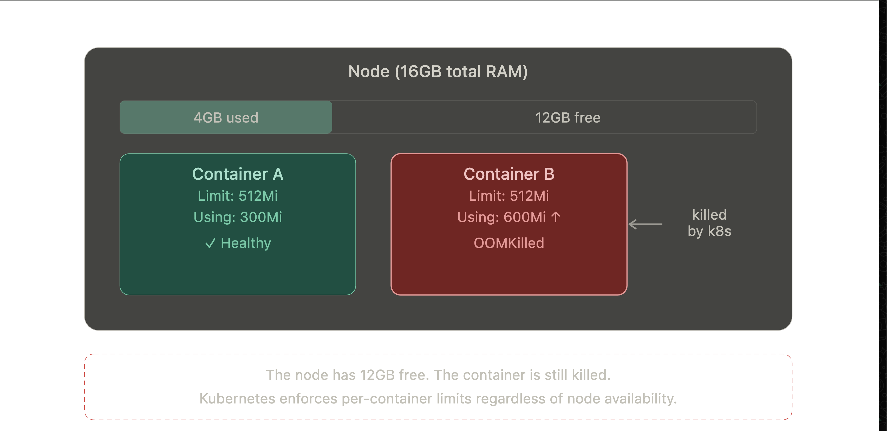
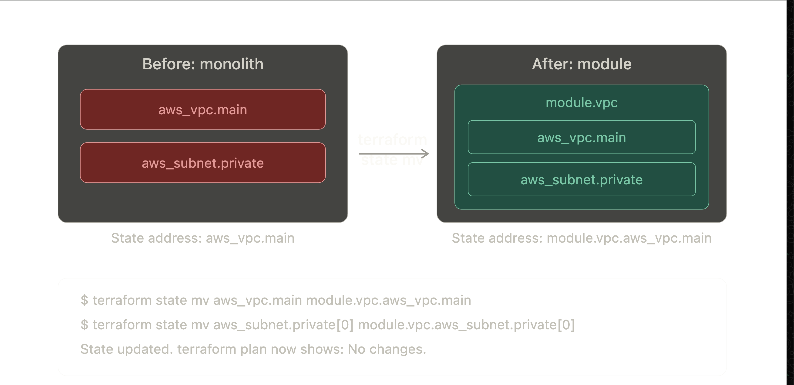
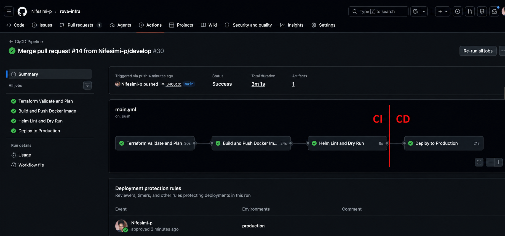

# Interview Questions & Answers

> These answers are written in the context of real implementation decisions made during this project. Where a question directly relates to something built in this repository, the answer references the actual code.

---

## Q1: Terraform State Management in a Team

**The short answer:** Use a remote backend with state locking so only one engineer can apply at a time and state is never lost.

**The detail:** Terraform state is a JSON file that tracks every resource it manages. If two engineers run `terraform apply` simultaneously against the same state file, one will overwrite the other's changes and corrupt state. The solution is two things working together: a remote backend (S3) so state is shared and not on anyone's laptop, and a lock table (DynamoDB) so only one apply can run at a time. Any engineer who tries to apply while another is running gets a lock error and has to wait.

**In this project:** I implemented this exactly. The `bootstrap/` module creates an S3 bucket with versioning and encryption, and a DynamoDB table with a `LockID` hash key. The pipeline initialises terraform with these values at runtime:

```hcl
resource "aws_s3_bucket" "tf_state" {
  bucket = "${var.project_name}-tfstate-${data.aws_caller_identity.current.account_id}"
}

resource "aws_dynamodb_table" "tf_lock" {
  name         = "${var.project_name}-tfstate-lock"
  billing_mode = "PAY_PER_REQUEST"
  hash_key     = "LockID"
}
```

```yaml
- name: Terraform Init
  run: |
    terraform init \
      -backend-config="bucket=${{ secrets.TFSTATE_BUCKET }}" \
      -backend-config="dynamodb_table=${{ secrets.TFSTATE_LOCK_TABLE }}"
```



**In production I would:** Use separate state files per environment so a mistake in dev cannot corrupt prod state, and restrict S3 bucket write access using IAM policies scoped per environment.

---

## Q2: Kubernetes Service Types

**The short answer:** ClusterIP is internal only, NodePort exposes on a node port, LoadBalancer provisions a cloud load balancer. In production EKS, use an Ingress controller backed by an ALB.

**The detail:**

| Service Type | Accessible From | Use Case |
|---|---|---|
| ClusterIP | Inside the cluster only | Internal microservice communication |
| NodePort | Outside via node IP and port | Dev/testing, not production |
| LoadBalancer | Public internet via cloud LB | Simple single-service exposure |
| Ingress + ALB | Public internet, path-based routing | Production, multiple services |

In production EKS the preferred approach is an **Ingress resource** backed by the **AWS Load Balancer Controller** which provisions an Application Load Balancer. This gives path-based routing, SSL termination, host-based routing, and a single load balancer for multiple services instead of one per application.


**In this project:** The helm chart uses a `ClusterIP` service internally and an `Ingress` resource to expose it externally:

```yaml
service:
  type: ClusterIP
  port: 80

ingress:
  enabled: true
  className: nginx
  host: api.dev.rova.com
```

**In production I would:** Switch `ingressClassName` to `alb` and use the AWS Load Balancer Controller with SSL termination and WAF integration.

---

## Q3: ArgoCD Self-Healing vs Automated Pruning

**The short answer:** ArgoCD detects the drift and depending on configuration either reverts it automatically or alerts and waits for manual sync.

**The detail:** When someone manually changes replica count from 3 to 10 using `kubectl`, ArgoCD detects that the live state no longer matches the desired state in Git. This is called drift.

**Self-Healing** means ArgoCD automatically reverts the change back to what Git says without human intervention. It is triggered by `syncPolicy.automated.selfHeal: true`. Think of it like a thermostat that automatically corrects temperature back to the set point regardless of what you do manually.

**Automated Pruning** handles resources that exist in the cluster but not in Git. If someone `kubectl apply`s a resource outside of Git, pruning removes it automatically. Without pruning, ArgoCD leaves orphaned resources alone.

In this scenario:
- With `selfHeal: true`: replicas revert to 3 within seconds
- Without `selfHeal`: ArgoCD marks the app as `OutOfSync` and waits for someone to click sync

**In production I would:** Enable self-healing for all applications but configure a `syncWindow` so automatic syncs cannot happen during business hours without approval.

---

## Q4: Scaling Kafka Consumer Lag

**The short answer:** Add more consumers, increase partition count, or optimise consumer processing logic.

**The detail:** Consumer lag means producers are writing faster than consumers are reading. Three most effective solutions:

**1. Add more consumer instances.** Kafka distributes partitions across consumers in a group. If you have 10 partitions and 2 consumers, each handles 5. Add 8 more and each handles 1. The hard limit is partition count: you cannot have more active consumers than partitions.

**2. Increase partition count.** If you are already at consumer-to-partition parity, add more partitions so you can add more consumers. Note: partition count can only be increased, never decreased without data loss.

**3. Optimise consumer processing.** If the bottleneck is slow processing per message rather than throughput, batching messages, reducing synchronous I/O, or processing in parallel threads per consumer helps more than adding instances.

**In production I would:** Set up consumer lag monitoring in Prometheus with alerts at a defined threshold, and use KEDA (Kubernetes Event Driven Autoscaler) to automatically scale consumer pods based on lag metrics.

---

## Q5: Helm Environment-Specific Configuration

**The short answer:** Use a base `values.yaml` for defaults and override files per environment. Inject at deploy time.

**The detail:** A single Helm chart can deploy to any environment by separating what changes from what stays the same. The base `values.yaml` holds sensible defaults. Each environment has its own values file that overrides only what differs. The pipeline passes the right file at deploy time using `-f`.

**In this project:**

```yaml
# values.yaml (dev defaults)
replicaCount: 2
podDisruptionBudget:
  minAvailable: 1
resourceQuota:
  hard:
    limits.cpu: "2"
ingress:
  host: api.dev.rova.com
```

```yaml
# values-prod.yaml (production overrides)
replicaCount: 3
podDisruptionBudget:
  minAvailable: 2
resourceQuota:
  hard:
    limits.cpu: "8"
ingress:
  host: api.rova.com
```



**In production I would:** Add a `values-staging.yaml` and use ArgoCD ApplicationSets to manage which values file each environment uses, rather than passing flags in the pipeline.

---

## Q6: Secure GitHub Actions AWS Authentication

**The short answer:** Use OIDC. GitHub mints a short-lived token per run. AWS verifies it and issues temporary credentials. No static keys anywhere.

**The detail:** The traditional approach stores `AWS_ACCESS_KEY_ID` and `AWS_SECRET_ACCESS_KEY` as GitHub secrets. These are long-lived credentials valid until manually rotated. If they leak in a log, a PR diff, or a GitHub breach, they are compromised until someone notices.

OIDC eliminates this entirely:

```diff
- Static access keys stored in GitHub secrets
- Valid until manually rotated
- If leaked, compromised indefinitely

+ OIDC token minted per workflow run
+ AWS verifies token came from this specific repo and branch
+ Credentials expire within the hour automatically
```

**In this project:** I built the full OIDC setup from scratch in `bootstrap/main.tf`:

```hcl
resource "aws_iam_openid_connect_provider" "github" {
  url            = "https://token.actions.githubusercontent.com"
  client_id_list = ["sts.amazonaws.com"]
}

data "aws_iam_policy_document" "github_assume" {
  statement {
    condition {
      test     = "StringLike"
      variable = "token.actions.githubusercontent.com:sub"
      values = [
        "repo:Nifesimi-p/rova-infra:ref:refs/heads/main",
        "repo:Nifesimi-p/rova-infra:ref:refs/heads/develop",
        "repo:Nifesimi-p/rova-infra:pull_request"
      ]
    }
  }
}
```

```yaml
permissions:
  id-token: write
  contents: read

- name: Configure AWS credentials via OIDC
  uses: aws-actions/configure-aws-credentials@v4
  with:
    role-to-assume: ${{ secrets.AWS_ROLE_ARN }}
    role-session-name: gha-${{ github.run_id }}
```



**In production I would:** Split into two roles: read-only for `terraform plan` on every PR and a write role for `terraform apply` on merge to main only. A compromised PR pipeline cannot destroy infrastructure.

---

## Q7: OOMKilled With Available Node Memory

**The short answer:** The container hit its memory limit, not the node's memory. These are two different things.

**The detail:** Kubernetes has two levels of memory management. The node has total RAM. Each container has a `resources.limits.memory` value in its spec. When a container exceeds its own limit, Kubernetes kills it with `OOMKilled` regardless of how much memory the node still has free.

Think of it like a water company setting a usage cap per household. Your neighbourhood might have plenty of supply, but if you exceed your household cap, your supply gets cut. The neighbourhood having water does not save you.

Common causes:
- Memory limit set too low for the actual workload
- Memory leak in the application
- Sudden traffic spike causing higher memory usage than the limit allows



**In this project:** Every container has explicit requests and limits:

```yaml
resources:
  requests:
    memory: 128Mi
  limits:
    memory: 512Mi
```

**In production I would:** Use Vertical Pod Autoscaler in recommendation mode to observe actual memory usage over time and suggest appropriate limit values, then set limits with headroom above the observed peak.

---

## Q8: Moving VPC Logic into a Reusable Module

**The short answer:** Use `terraform state mv` to update the state address without touching the actual infrastructure.

**The detail:** When you move code into a module, Terraform sees a new resource address (`module.vpc.aws_vpc.main` instead of `aws_vpc.main`) and thinks the old resource needs to be destroyed and recreated. The infrastructure has not changed but the state address has.

The fix is `terraform state mv` which updates the state file to use the new address without touching real infrastructure:

```bash
terraform state mv aws_vpc.main module.vpc.aws_vpc.main
terraform state mv aws_subnet.private[0] module.vpc.aws_subnet.private[0]
```

After running these commands, `terraform plan` shows no changes because state now matches the new code structure.



**In production I would:** Always run `terraform plan` after state moves to confirm zero changes before applying. Use `terraform state list` before and after to verify every resource address was moved correctly.

---

## Q9: Kafka Brokers on Kubernetes

**The short answer:** StatefulSet with PersistentVolumeClaims. Never a Deployment.

**The detail:** Kafka brokers are stateful. Each broker has a unique ID and stores partition data on disk. If a broker pod restarts on a new node, it must reconnect with the same broker ID and find its data intact.

A `Deployment` gives pods random names and no persistent storage guarantees. A `StatefulSet` gives each pod a stable identity (`kafka-0`, `kafka-1`, `kafka-2`) and a dedicated `PersistentVolumeClaim` that follows the pod across restarts.

```yaml
apiVersion: apps/v1
kind: StatefulSet
metadata:
  name: kafka
spec:
  serviceName: kafka-headless
  replicas: 3
  volumeClaimTemplates:
    - metadata:
        name: kafka-data
      spec:
        accessModes: [ReadWriteOnce]
        resources:
          requests:
            storage: 100Gi
```

The `serviceName` points to a headless Service which gives each pod a stable DNS name (`kafka-0.kafka-headless`) that other services use to connect to specific brokers.

**In production I would:** Use the Strimzi Kafka Operator which manages Kafka StatefulSets, rolling updates, and broker rebalancing automatically rather than managing raw StatefulSets by hand.

---

## Q10: Commit to Production Pipeline

**The short answer:** CI ends after the image is built and tested. CD begins when that verified artefact is deployed to an environment.

**The detail:** The boundary between CI and CD is the artefact. CI produces a verified, immutable artefact (a Docker image tagged with the commit SHA). CD takes that artefact and deploys it to environments.

**In this project the full flow is:**

```
Developer pushes code
        │
        ▼
GitHub Actions (CI)
  ├── terraform fmt and validate
  ├── terraform plan against real AWS
  ├── Docker build and push to Docker Hub (tagged sha-xxxxxxx)
  └── helm lint and template render
        │
        │  ◄── CI ends here. A verified image exists.
        ▼
Manual Approval Gate
        │
        ▼
GitHub Actions (CD)
  ├── terraform apply (provisions infrastructure if needed)
  └── helm upgrade --install (deploys the verified image to EKS)
```



**With ArgoCD this becomes:** CI pushes the image and updates the image tag in a Git manifest repo. ArgoCD detects the manifest change and syncs the cluster. CD is now pull-based rather than push-based, meaning the cluster always reflects Git and drift is impossible.

**In production I would:** Use ArgoCD for CD so deployment is declarative, auditable, and self-healing. GitHub Actions handles CI only and commits the new image tag to a separate GitOps repo. ArgoCD handles the rest.

---

*Answers written by Precious Jesutofunmi Olowookere in the context of the FCMB Rova platform engineering assessment.*
