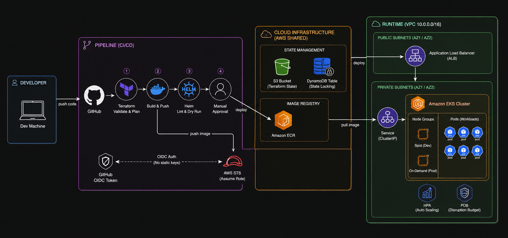

# Rova Infrastructure

> This repository provisions and manages the cloud infrastructure for the Rova platform, FCMB's modern banking service. Every time a developer pushes code, this pipeline validates it, builds it into a Docker image, checks that it will deploy correctly, and gates production behind a human approval. The goal is simple: no broken code reaches customers, and no engineer needs to touch a server manually.

---

## What This Does

| Layer | Tool | What it provisions |
|---|---|---|
| Infrastructure | Terraform | VPC, EKS cluster, ECR repository |
| Containerisation | Docker | Python FastAPI microservice image |
| Deployment | Helm | Kubernetes manifests with PDB, ResourceQuota, HPA |
| CI/CD | GitHub Actions | Validate, build, lint, and deploy pipeline |
| Security | OIDC | Keyless AWS authentication from GitHub Actions |

---

## Repository Structure

```
rova-infra/
├── bootstrap/          # One-time account setup (OIDC, state bucket, IAM role)
├── modules/ecr/        # Reusable ECR Terraform module
├── helm/microservice/  # Helm chart for the microservice
├── app/                # FastAPI application source
├── environments/       # Per-environment tfvars (dev, prod)
├── docs/adr/           # Architecture Decision Records
├── docs/screenshots/   # Annotated pipeline screenshots
├── main.tf             # Root Terraform configuration (VPC, EKS, ECR)
├── backend.tf          # Remote state configuration
├── Makefile            # Shortcuts for common commands
└── .github/workflows/  # CI/CD pipeline
```

---

## Architecture

The infrastructure runs in AWS `eu-west-1` across two availability zones. The EKS cluster sits in private subnets and communicates with the internet through a NAT gateway. ECR stores the Docker images the cluster pulls at deploy time. GitHub Actions authenticates to AWS using OIDC, which means no static credentials exist anywhere in the pipeline.

```
GitHub Actions
      │
      │  OIDC token (short-lived, per run)
      ▼
AWS STS ──► IAM Role (rova-github-actions)
      │
      ├──► S3 (terraform state)
      ├──► ECR (docker images)
      └──► EKS (kubernetes cluster)
                │
                ├── VPC (10.0.0.0/16)
                │     ├── Private subnets (worker nodes)
                │     └── Public subnets (load balancers)
                │
                └── Node Group
                      ├── dev:  t3.small, spot instances
                      └── prod: t3.medium, on-demand
```

---



## Pipeline

Every pull request targeting `develop` or `main` runs through four stages. No code lands on main without passing all three automated checks first. The production deployment job then pauses for manual approval even after the pipeline is green. A broken change would have to pass automated checks AND get human sign-off before reaching production.


```
Terraform Validate and Plan
         │
         ▼
Build and Push Docker Image
         │
         ▼
Helm Lint and Dry Run
         │
         ▼
Deploy to Production (main only, manual approval required)
```

---

## Terraform Plan

The pipeline runs a real `terraform plan` against AWS on every PR using OIDC credentials. This proves the infrastructure configuration is valid before any code merges. The plan covers 54 resources including the VPC, EKS cluster, node groups, ECR repository, and all supporting networking.


---

## Production Deployment Gate

After all three checks pass on main, the pipeline pauses and waits for a named reviewer to approve before proceeding. This is a second manual gate on top of the PR review process. Defence in depth: automated checks catch technical issues, human approval catches everything else.


---

## Best Practices Applied

This section explicitly documents every best practice applied across each layer of the stack. These were not added for the sake of it. Each one exists because skipping it creates a real problem in production.

### Terraform

| Practice | Where | Why |
|---|---|---|
| Remote state in S3 with versioning | `backend.tf` | State can be recovered if corrupted. Multiple engineers cannot overwrite each other. |
| State locking with DynamoDB | `bootstrap/main.tf` | Prevents two `terraform apply` runs from conflicting and corrupting state |
| Reusable module for ECR | `modules/ecr/` | The same module can provision ECR for any service without duplicating code |
| Immutable image tags on ECR | `modules/ecr/main.tf` | Once a tag is pushed it cannot be overwritten. Every deployment is traceable to a commit. |
| Lifecycle policy on ECR | `modules/ecr/main.tf` | Untagged images expire after 7 days. Only the last 10 tagged images are kept. Storage cost stays controlled. |
| Per-environment tfvars | `environments/` | Dev and prod differ in instance type, replica count, and spot usage. No hardcoded values in the main config. |
| `terraform fmt` enforced in CI | `.github/workflows/main.yml` | Formatting is never a PR comment. It is a pipeline failure. |
| `terraform validate` in CI | `.github/workflows/main.yml` | Catches syntax and provider errors before any plan runs |

### EKS

| Practice | Where | Why |
|---|---|---|
| Worker nodes in private subnets | `main.tf` | Nodes are never directly reachable from the internet |
| Public and private endpoint access | `main.tf` | The API server is reachable from within the VPC and from authorised external IPs |
| IRSA enabled | `main.tf` | Pods can assume IAM roles via service account annotations rather than sharing the node role |
| Spot instances in dev only | `environments/dev.tfvars` | ~66% cost saving in dev. Production stays on on-demand for reliability. |
| Subnet tags for load balancer discovery | `main.tf` | EKS uses these tags to know which subnets to place internal vs internet-facing load balancers in |

### GitHub Actions

| Practice | Where | Why |
|---|---|---|
| OIDC authentication | `.github/workflows/main.yml` | No static AWS credentials anywhere. Tokens are short-lived and scoped to this repo. |
| Least privilege permissions block | `.github/workflows/main.yml` | `id-token: write` and `contents: read` only. No write access to the repo from the pipeline. |
| `role-session-name` includes run ID | `.github/workflows/main.yml` | Every AWS CloudTrail log entry is traceable back to the exact pipeline run that made the API call |
| Docker push skipped on PRs | `.github/workflows/main.yml` | The image builds on every PR to catch Dockerfile errors, but only pushes on merge to avoid publishing unreviewed images |
| Plan artifact uploaded | `.github/workflows/main.yml` | The plan file is saved for 7 days so anyone can inspect exactly what terraform would have applied |
| Manual approval gate on production | `.github/workflows/main.yml` | Production deployment requires a named reviewer even after all automated checks pass |
| Branch protection with required checks | GitHub settings | No PR can merge to `develop` or `main` without all three jobs passing |

### Docker

| Practice | Where | Why |
|---|---|---|
| Multi-stage build | `Dockerfile` | Builder stage installs dependencies. Runtime stage copies only what is needed. Final image has no build tools. |
| Non-root user (UID 1000) | `Dockerfile` | Container cannot run as root. Limits blast radius if the process is compromised. |
| Healthcheck defined | `Dockerfile` | Docker and Kubernetes both use this to know when the container is ready |
| SHA-based image tags | `.github/workflows/main.yml` | Every image is traceable to a specific git commit. No mutable `:latest` tags. |
| Docker Hub access token, not password | GitHub secrets | Token is scoped to push only. Revokable without changing the account password. |

### Helm

| Practice | Where | Why |
|---|---|---|
| Dynamic `image.repository` | `helm/microservice/values.yaml` | The pipeline injects the real image URI at deploy time. The chart works for any registry. |
| Pod Disruption Budget | `helm/microservice/templates/pdb.yaml` | Kubernetes cannot evict all pods at once during node drains or cluster upgrades |
| Resource Quota | `helm/microservice/templates/resourcequota.yaml` | Caps namespace resource consumption so one service cannot starve the cluster |
| Resource requests and limits | `helm/microservice/values.yaml` | Kubernetes uses requests for scheduling and limits for enforcement. Both must be set. |
| Security context | `helm/microservice/templates/deployment.yaml` | Non-root user, read-only root filesystem, all capabilities dropped, no privilege escalation |
| Liveness and readiness probes | `helm/microservice/values.yaml` | Kubernetes restarts unhealthy pods and removes them from load balancer rotation before they are ready |
| HPA configured | `helm/microservice/templates/hpa.yaml` | Scales replicas automatically based on CPU. No manual intervention needed under load. |
| Config in ConfigMap not env vars | `helm/microservice/templates/configmap.yaml` | Configuration is decoupled from the image. Changing config does not require rebuilding the image. |
| Checksum annotation on deployment | `helm/microservice/templates/deployment.yaml` | When the ConfigMap changes, pods restart automatically to pick up the new config |
| `helm lint --strict` in CI | `.github/workflows/main.yml` | Promotes warnings to errors. Catches deprecated APIs and missing best practice fields before they reach a cluster. |
| Per-environment values files | `helm/microservice/values-prod.yaml` | Production gets more replicas, stricter PDB, and larger resource quota without touching the base chart |

---

## The Bootstrap Problem

Before the pipeline could run, it needed AWS credentials. But credentials were what the pipeline was supposed to create. This is the classic chicken-and-egg problem in DevOps, and it is the first real engineering decision this project had to solve.

The solution is a separate `bootstrap/` module that runs exactly once from a laptop with admin credentials. It creates four things: the S3 bucket that stores terraform state, the DynamoDB table that prevents two engineers from running apply at the same time, the GitHub OIDC provider that lets AWS trust tokens from GitHub Actions, and the IAM role the pipeline assumes on every run, scoped to this repo and branch only.

After bootstrap runs, the outputs go into GitHub secrets and the pipeline takes over permanently. The laptop never needs admin credentials again. Every pipeline run from that point authenticates through OIDC, gets short-lived credentials, and those credentials expire within the hour whether or not someone remembers to revoke them.

> Bootstrap state stays local intentionally. If it lived in the same S3 bucket it manages, deleting the bucket would also delete the record of the bucket existing. Local state for bootstrap is the standard pattern for this reason. In a real team setup, bootstrap state would live in a separate dedicated ops account.

---

## Security Decisions

**No long-lived AWS credentials anywhere.** The pipeline uses OIDC to assume an IAM role. GitHub mints a short-lived token per workflow run. AWS verifies the token came from this specific repository and branch before issuing credentials that expire within the hour.

**The IAM role trust policy is scoped tight.** Only workflows running in `Nifesimi-p/rova-infra` on `main`, `develop`, or a pull request can assume the role. Any other caller gets rejected at the AWS level regardless of whether they have the role ARN.

**Docker Hub uses an access token, not the account password.** The token is scoped to push only. If it leaks it can be revoked without touching the account or affecting other integrations.

**Sensitive data handling.** Three values live in GitHub secrets: `AWS_ROLE_ARN`, `TFSTATE_BUCKET`, and `TFSTATE_LOCK_TABLE`. The role ARN is not sensitive on its own since the trust policy rejects anyone outside this repo. The bucket and table names are stored as secrets to keep AWS account details out of the codebase.

**What I would do differently in a real production setup:**

```diff
- Single IAM role for all pipeline operations
+ Separate read-only role for terraform plan on PRs
+ Separate write role for terraform apply on merge to main only
+ Per-environment roles so dev pipeline cannot touch prod resources

- GitHub secrets for backend config values
+ Fetch all values from AWS SSM Parameter Store at runtime

- Docker Hub for image storage
+ Push to ECR directly, eliminating the Docker Hub secret entirely
```

---

## Helm Chart

The chart in `helm/microservice/` is generic enough to deploy any containerised service on the Rova platform.

**Dynamic image injection.** The pipeline sets `image.repository` and `image.tag` at deploy time. The chart never has a hardcoded image reference.

**Pod Disruption Budget.** Dev uses `minAvailable: 1` so at least one pod survives node drains. Production uses `minAvailable: 2` out of three replicas so rolling updates never take more than one pod down at a time.

**Resource Quota.** Caps total namespace resource consumption so one noisy service cannot starve the cluster. Dev quota is intentionally smaller than production.

**Security context.** Every container runs as a non-root user (UID 1000), with a read-only root filesystem, all Linux capabilities dropped, and privilege escalation blocked.

**HPA.** Autoscales between 2 and 10 replicas based on CPU utilisation. Production threshold is 60%, dev is 70%, giving production more headroom before scaling kicks in.

---

## Cost Reasoning

Every infrastructure decision was made with cost in mind:

| Decision | Dev | Prod | Saving |
|---|---|---|---|
| Node capacity type | Spot (t3.small) | On-demand (t3.medium) | ~$14/month on dev |
| NAT gateway | Single | Should be per-AZ | ~$32/month on dev |
| DynamoDB billing | PAY_PER_REQUEST | PAY_PER_REQUEST | No idle cost |
| ECR lifecycle policy | 7 day untagged expiry | 7 day untagged expiry | Reduces storage cost |

The NAT gateway is the decision I would revisit first before going to production. It saves $32/month in dev but it is a single point of failure. If the availability zone hosting the NAT goes down, pods in the surviving AZ lose internet access and cannot pull new images from ECR. The fix is either per-AZ NAT gateways or VPC endpoints for ECR and S3, which would also reduce data processing costs. For a dev environment this trade-off is fine. For production it is not.

---

## How to Run This

### Prerequisites

- AWS CLI configured with admin credentials
- Terraform >= 1.5.0
- Helm >= 3.14.0
- Docker

### Step 1: Bootstrap (one time only)

```bash
cd bootstrap
terraform init
terraform apply
```

Copy the three outputs into GitHub repository secrets:

| Terraform Output | GitHub Secret Name |
|---|---|
| `github_actions_role_arn` | `AWS_ROLE_ARN` |
| `tfstate_bucket` | `TFSTATE_BUCKET` |
| `tfstate_lock_table` | `TFSTATE_LOCK_TABLE` |

### Step 2: Plan infrastructure

```bash
make init
make plan
```

### Step 3: Validate the helm chart locally

```bash
make helm-lint
make helm-dry-run
```

### Step 4: Push a branch and open a PR

The pipeline runs automatically. All three checks must pass before the PR can merge.

---

## Architecture Decision Records

Every major decision in this project has a corresponding ADR explaining the context, the trade-offs considered, and what would be done differently in a larger production setup.

| ADR | Decision |
|---|---|
| [001](./docs/adr/001-oidc-over-access-keys.md) | OIDC instead of long-lived AWS access keys |
| [002](./docs/adr/002-bootstrap-as-separate-module.md) | Separate bootstrap module from main configuration |
| [003](./docs/adr/003-immutable-image-tags.md) | Immutable ECR image tags |
| [004](./docs/adr/004-pdb-min-available.md) | PDB minAvailable values per environment |
| [005](./docs/adr/005-spot-in-dev-only.md) | Spot instances in dev, on-demand in prod |
| [006](./docs/adr/006-single-nat-gateway.md) | Single NAT gateway in dev |

---

## Issues Encountered

Real problems hit during development, documented here because they are the kind of thing that does not show up in tutorials.

**`Chart.yaml` filename casing.** Helm requires exact capitalisation. The file was initially saved as `chart.yaml` and helm refused to recognise it. Fixed with `mv chart.yaml Chart.yaml`.

**`terraform fmt` failing on map key alignment.** The VPC subnet tags had inconsistent spacing. `terraform fmt -recursive` fixed it. Pre-commit now runs this automatically before every commit so it never fails in CI again.

**Branch divergence after clicking "Update branch" on GitHub.** GitHub's update branch button performs a merge commit on the remote. If you have unpushed local commits at the same time, your local and remote histories diverge. The fix is to always use `git rebase origin/develop` locally instead of clicking the button.

**Multiple CI fixes stacked on one branch.** Early pipeline fixes were piled onto a single branch making it hard to review and reason about. Each subsequent fix got its own branch. One branch per problem is the rule going forward.

**Terraform plan failing without AWS credentials.** The original pipeline used placeholder credentials. Switching to real AWS with OIDC required the bootstrap module to exist first, which required understanding and solving the chicken-and-egg problem described in [ADR 002](./docs/adr/002-bootstrap-as-separate-module.md).

**`helm install --dry-run` requiring a live cluster.** The brief specifies `helm install --dry-run --debug` to simulate deployment. In practice, even `--dry-run=client` in Helm 3.14 attempts server-side validation before falling back, which fails without a cluster connection in the pipeline runner. Switched to `helm template` which renders manifests entirely client-side with no cluster dependency. This is actually the more correct tool for pure template validation. `helm install --dry-run` is better suited for environments where a dev cluster already exists and you want to simulate the full install lifecycle against it.

**OIDC trust policy rejecting the production environment token.** GitHub includes the environment name in the OIDC token subject when a job uses `environment: production`. The initial trust policy only allowed branch and pull request subjects, so the deploy job was rejected by AWS STS. Fixed by adding the production environment subject to the trust policy in bootstrap.

---

## What I Would Add Next

```diff
+ Per-AZ NAT gateways in production for true high availability
+ VPC endpoints for ECR and S3 to reduce NAT cost and eliminate the single point of failure
+ Separate read and write IAM roles so terraform plan cannot mutate infrastructure
+ Trivy image scanning in the pipeline to catch CVEs before images reach ECR
+ Scheduled terraform plan to detect drift between code and actual AWS state
+ Multi-environment pipeline with explicit promotion from dev to staging to prod
```

---

*Built by Precious Jesutofunmi Olowookere for the FCMB Rova platform engineering assessment.*